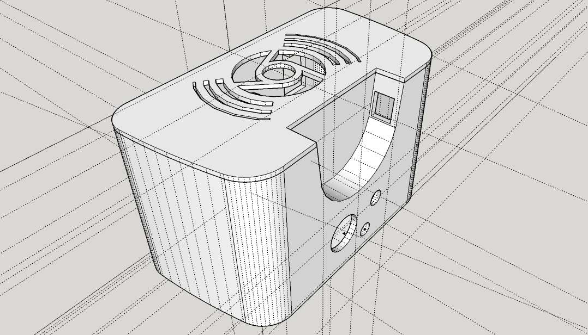

Chromecast Audio + Amplifier 3D Box
===================================

The file `chromecast-audio-amplifier-box.skp` is the Sketchup 3D model for both the box body and cover.

To 3D-print the box, use the STL files `chromecast-audio-amplifier-box-body.stl` and `chromecast-audio-amplifier-box-cover.stl`.

Related blog post: https://medium.com/@frapontillo/c972db631dc2.

## License

 This work is licensed under a <a rel="license" href="http://creativecommons.org/licenses/by-sa/4.0/">Creative Commons Attribution-ShareAlike 4.0 International License</a>.

Chromecast is a trademark of Google Inc.